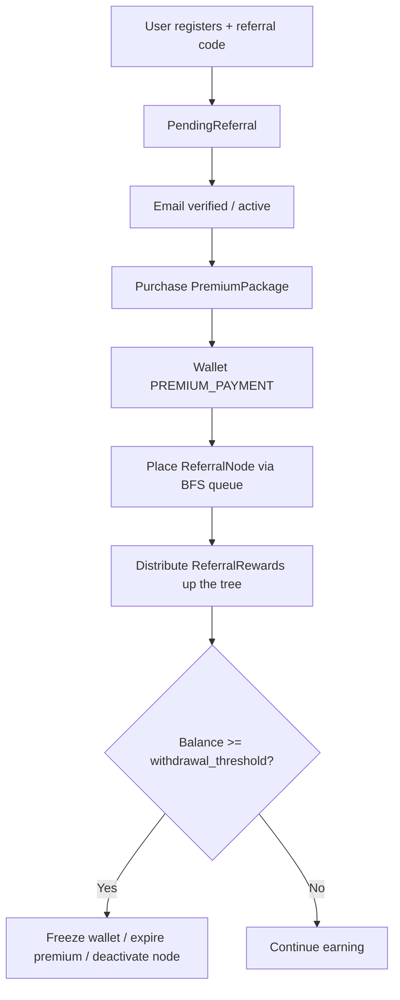

# Uptorps Backend

Django REST API for **Uptorps** — an education and premium referral platform. It handles authentication, quizzes, premium subscriptions, a binary referral tree with rewards, and a ledger-based wallet system (GHS).

## Features

- **Accounts** — email-based auth, JWT (access + rotating refresh), email verification, password reset, role-based access, account lockout, rate limiting
- **Quizzes** — hierarchical content (Difficulty → Level → Programme → Course → Quiz → Questions → Options) with attempts and scoring
- **Premium** — purchasable packages with duration, referral caps, and earning withdrawal thresholds
- **Wallet** — immutable ledger transactions, withdrawals, balance reconciliation, premium-threshold freezing
- **Referral** — binary tree placement (BFS), pending referrals, multi-level reward percentages
- **Audits** — security/admin action logging (admin create/delete, login events, throttling)
- **API docs** — HTML docs at `/docs/auth/` and `/docs/quiz/`
- **Background jobs** — Celery + Redis (wallet reconciliation, premium expiry)

## Tech stack

| Layer | Technology |
|-------|------------|
| Framework | Django 5.2+ / 6.0, Django REST Framework |
| Auth | SimpleJWT (Bearer), token blacklist |
| Task queue | Celery 5, Redis |
| Config | `python-dotenv` (`.env`) |
| Database | Configurable via env (SQLite by default in local setup) |
| Currency | GHS |

## Project structure

```
uptorps-backend/
├── accounts/          # Users, auth, email flows, permissions, throttles
├── audits/            # AuditLog model + signal handlers
├── quizzes/           # Learning hierarchy + quiz attempts
├── premium/           # Packages + user subscriptions
├── wallet/            # Wallet, Transaction, Withdrawal + Celery tasks
├── referral/          # ReferralNode, PlacementQueue, rewards
├── payments/          # Payment gateway placeholder (not wired yet)
├── docs/              # HTML API documentation views
├── core/              # Django settings, URLs, Celery app
├── templates/         # Docs HTML templates
├── static/            # Static assets
├── manage.py
├── requirements.txt   # Minimal pins
└── requirement.txt    # Full dependency lock (includes Celery/Redis)
```

## Apps overview

### `accounts`
Custom `User` model (`AUTH_USER_MODEL = accounts.User`). Login field is **email**.

**Roles:** `ADMIN`, `TEACHER`, `STUDENT`, `PREMIUM_STUDENT`, `PREMIUM_TEACHER`, `SYS`

Admin users may have `admin_type` (`MANAGER` / `DEVELOPER`) and developers a `dev_specialization` (`FRONTEND` / `BACKEND` / `SECURITY`).

Security behaviors include failed-login lockout, scoped throttles on auth endpoints, email verification before full activation, and JWT refresh rotation with blacklist.

### `quizzes`
Content hierarchy:

```
Difficulty → Level → Programme → Course → Quiz → Question → AnswerOption
```

Users take a quiz via `QuizAttempt` → `UserAnswer`. One attempt per user per quiz.

### `premium`
- `PremiumPackage` — price, `duration_days`, `max_referrals`, `withdrawal_threshold`
- `UserPremiumSubscription` — links user, package, and payment `Transaction`

When wallet balance hits the package threshold, premium expires: balance moves to `reserved`, wallet freezes, referral node deactivates, and role downgrades (e.g. `PREMIUM_STUDENT` → `STUDENT`).

### `wallet`
- `Wallet` — `balance`, `reserved`, `total_earned`, status (`ACTIVE` / `FROZEN` / `SUSPENDED`); records are not deletable
- `Transaction` — types: `REFERRAL_BONUS`, `WITHDRAWAL`, `PREMIUM_PAYMENT`; direction credit/debit; immutable ledger
- `Withdrawal` — request/approval flow with flexible `payout_info` JSON

Daily Celery Beat job reconciles all wallets from completed ledger entries (02:00).

### `referral`
Binary tree MLM-style placement:

| Model | Purpose |
|-------|---------|
| `PendingReferral` | Stores referral intent at registration until premium placement |
| `ReferralNode` | Tree node (left/right children, depth, referral code, version) |
| `PlacementQueue` | BFS bookmark for next open slot in a tree |
| `ReferralReward` | Ancestor payouts per purchase event |

Reward percentages by depth difference: **20% / 10% / 5% / 3%**, then **1%** for deeper levels.

### `audits`
`AuditLog` tracks admin/security actions (create/delete admin or user, admin login success/failure, login throttled).

### `payments`
Scaffold for gateway integration — not exposed in root URLs yet.

## API endpoints

Base path prefixes (see `core/urls.py`):

| Prefix | App |
|--------|-----|
| `/admin/` | Django admin |
| `/api/accounts/` | Auth & users |
| `/api/quizz/` | Quizzes |
| `/api/wallet/` | Wallet |
| `/api/premium/` | Premium packages |
| `/api/referral/` | Referral (routes reserved; views not wired yet) |
| `/docs/` | HTML API docs |

### Accounts — `/api/accounts/`

| Method | Path | Description |
|--------|------|-------------|
| POST | `register/` | Register user (optional referral code) |
| POST | `verify-email/` | Confirm email with token |
| POST | `resend-verification/` | Resend verification email |
| POST | `login/` | Obtain JWT access + refresh |
| POST | `refresh/` | Refresh access token |
| POST | `create-admin/` | Create admin (privileged) |
| DELETE | `users/<uuid>/delete/` | Delete user |
| POST | `password-reset/` | Request reset email |
| POST | `password-reset/confirm/` | Confirm new password |
| GET/PATCH | `users/info/<uuid>/` | User detail / update |

Auth header: `Authorization: Bearer <access_token>`

### Quizzes — `/api/quizz/`

Most hierarchy endpoints share one URL and accept multiple verbs (`GET` list/filter, `POST` create, `PUT` update, `DELETE` remove). `GET` is available to authenticated users; write methods require admin.

| Method | Path | Description |
|--------|------|-------------|
| GET, POST, PUT, DELETE | `difficulty/` | List / create / update / delete difficulties |
| GET, POST, PUT, DELETE | `level/` | Levels (GET requires `?difficulty=`) |
| GET, POST, PUT, DELETE | `programme/` | Programmes |
| GET, POST, PUT, DELETE | `course/` | Courses |
| GET, POST, PUT, DELETE | `quiz/` | Quizzes |
| GET, POST, PUT, DELETE | `question/` | Questions |
| GET, POST, PUT, DELETE | `answer/` | Answer options |
| POST | `attempt/start/<quiz_uuid>/` | Start attempt |
| POST | `attempt/submit/` | Submit answers |

Submit payload shape:

```json
{
  "attempt_id": "de6f4b37-7393-4b1a-bbf8-1f26c3ab8f5c",
  "answers": [
    {
      "question": "question_uuid",
      "selected_options": ["option_uuid"]
    }
  ]
}
```

### Wallet — `/api/wallet/`

| Method | Path | Description |
|--------|------|-------------|
| GET | `detail/` | Current user wallet |
| GET | `transactions/` | Transaction list |
| GET | `withdrawals/` | Withdrawal list |
| POST | `withdraw/` | Request withdrawal |
| GET | `stats/` | Wallet stats |

### Premium — `/api/premium/`

| Method | Path | Description |
|--------|------|-------------|
| GET | `packages/` | List packages |
| POST | `purchase/` | Purchase premium package |

### Docs

| Path | Content |
|------|---------|
| `/docs/auth/` | Accounts / auth documentation |
| `/docs/quiz/` | Quiz documentation |

OpenAPI export also exists as `openapi.json` (title: **Uptorps API**).

## Deploy to Render

A Render deployment config is included at the repo root in `render.yaml`.

It provisions:

- one web service using the existing Dockerfile in `backend/`
- one PostgreSQL database
- one Redis instance
- one Celery worker and one Celery beat worker

### Render setup steps

1. Push this repository to GitHub.
2. In Render, create a new "Blueprint" deployment and select this repo.
3. Render will read `render.yaml` and create the web service, database, Redis, and worker processes.
4. After deployment completes, set any final secrets you want to override (for example SMTP email credentials).

### Recommended environment values

```env
SECRET_KEY=replace-with-a-long-random-secret
DEBUG=False
ALLOWED_HOSTS=uptorps-web.onrender.com
HOST=https://uptorps-web.onrender.com
EMAIL_BACKEND=django.core.mail.backends.console.EmailBackend
```

Render creates the database and Redis URLs automatically for the services listed in `render.yaml`.

## Prerequisites

- Python 3.10+
- Redis (for Celery broker/result backend)
- Virtual environment recommended

## Setup

### 1. Clone and create a virtualenv

```bash
cd uptorps-backend
python3 -m venv virt
source virt/bin/activate
```

### 2. Install dependencies

Prefer the full lockfile (includes Celery, Redis, etc.):

```bash
pip install -r requirement.txt
```

Or the minimal set:

```bash
pip install -r requirements.txt
```

If using Celery locally, also ensure Redis is installed and running:

```bash
# example (Ubuntu/Debian)
sudo apt install redis-server
sudo systemctl start redis
```

### 3. Environment variables

Create a `.env` in the project root (do not commit it):

```env
SECRET_KEY=your-django-secret-key
DEBUG=True
ALLOWED_HOSTS=localhost,127.0.0.1
HOST=http://127.0.0.1:8000

DB_ENGINE=django.db.backends.sqlite3
DB_NAME=db.sqlite3
DB_USER=
DB_PASSWORD=
DB_HOST=
DB_PORT=

EMAIL_BACKEND=django.core.mail.backends.console.EmailBackend
EMAIL_HOST=
EMAIL_PORT=587
EMAIL_USE_TLS=True
EMAIL_HOST_USER=
EMAIL_HOST_PASSWORD=
DEFAULT_FROM_EMAIL=Security <no-reply@uptorps.com>
```

Notes:

- `SECRET_KEY` is required; the app raises if it is missing.
- When `DEBUG` is not `True`, SSL/secure cookie settings are enabled.
- Celery broker defaults in settings: `redis://localhost:6379/0` (results on DB `1`).

### 4. Migrate and seed

```bash
python manage.py migrate
python manage.py seed_account   # system (SYS) wallet users
python manage.py seed_wallet    # wallets for those system users
python manage.py createsuperuser
```

### 5. Run the API server

```bash
python manage.py runserver
```

### 6. Run Celery (required for wallet reconciliation & premium expiry)

```bash
celery -A core worker --loglevel=info
celery -A core beat --loglevel=info
```

Dev auto-reload (optional, needs `watchdog`):

```bash
watchmedo auto-restart --directory=./ --pattern='*.py' --recursive -- celery -A core worker --loglevel=info
watchmedo auto-restart --directory=./ --pattern='*.py' --recursive -- celery -A core beat --loglevel=info
```

## Authentication & throttling

| Setting | Value |
|---------|--------|
| Access token lifetime | 60 minutes |
| Refresh token lifetime | 1 day |
| Refresh rotation | Enabled (old token blacklisted) |
| Email verification token | 30 minutes (`TOKEN_VERIFICATION_DURATION`) |

Default DRF permission: authenticated. Auth endpoints use scoped throttles (e.g. login `10/min` user / `3/min` admin, register `3/min`, password reset `3/min`).

## Background tasks

| Task | Schedule / trigger | Purpose |
|------|--------------------|---------|
| `wallet.tasks.reconcile_all_wallets` | Daily 02:00 (Celery Beat) | Fix balance drift vs ledger |
| `wallet.tasks.trigger_premium_expiry` | After threshold hit | Freeze wallet, expire premium, deactivate referral |

## Domain flows (high level)



## Management commands

| Command | Description |
|---------|-------------|
| `python manage.py seed_account` | Creates SYS users used as platform wallets |
| `python manage.py seed_wallet` | Creates wallets for those SYS users |

Seed order matters: run `seed_account` before `seed_wallet`.

## Testing

```bash
python manage.py test
# or targeted suites, e.g.
python test_accounts_security.py
```

## Production notes

- Set `DEBUG=False` and a strong `SECRET_KEY`.
- Configure a real database (`DB_ENGINE`, credentials) and email SMTP settings.
- Serve behind HTTPS; secure cookies and SSL redirect activate when `DEBUG` is false.
- Run `collectstatic`, Celery worker, and Celery Beat as long-lived processes.
- Keep Redis available for the broker.

## Roadmap / known gaps

Tracked informally in `later-features.txt` / `MustDo.txt`:

- Payment gateway wiring (`payments` app)
- Referral HTTP API views
- Throttle / suspicious-activity email notifications
- Frontend URLs for email verification deep links
- Further admin audit UI polish

## License

Proprietary — all rights reserved unless otherwise stated by the project owners.
